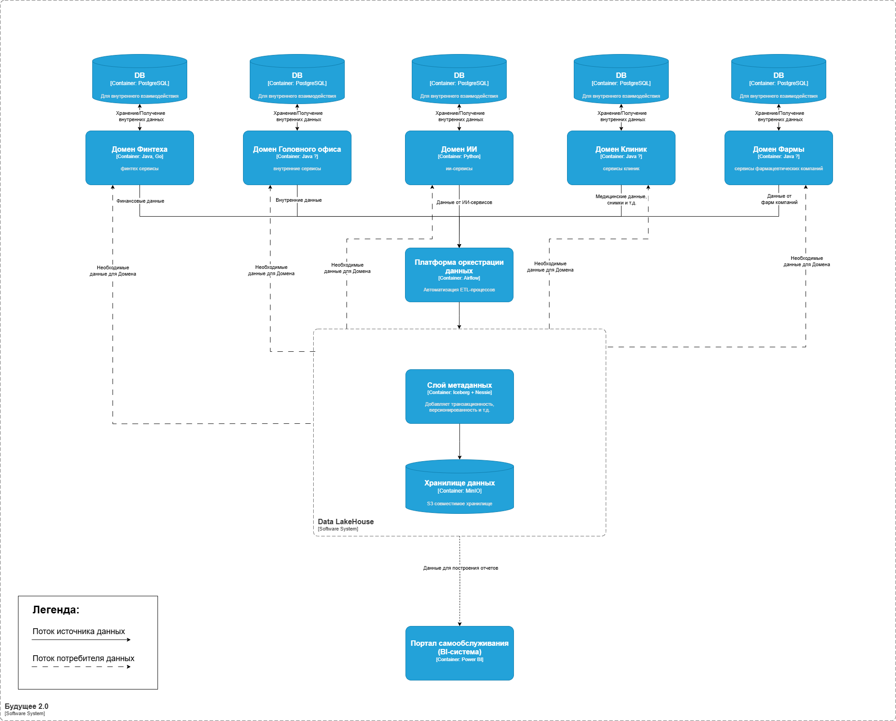

# Задание 1

## Архитектура системы через год

## Анализ проблемных мест

| Проблема                                    | Описание                                                                                                             |
|---------------------------------------------|----------------------------------------------------------------------------------------------------------------------|
| Одно хранилище для всех источников данных   | Разные по своей сути данные (структурированные данные для BI и не структурированные для AI) хранятся в одном DWH.    |
| Безопасность и управление доступом          | Отсутствие централизованного управления доступами к данным                                                           |
| Устаревший DWH                              | Microsoft SQL-сервер 2008 устарел и снят с поддержки                                                                 |
| Проблемы с масштабированием                 | Большое количество бизнес-логики реализовано непосредственно в DWH, что усложняет добавление новых источников данных |
| Длительные задержки при построениях отчетов | Сложные отчёты можно ждать часами из-за большого количества трансформаций                                            |
| Устаревшая шина данных                      | Интеграционная шина устарела, могут возникнуть сложности с ее поддержкой и развитием                                 |

## Приоритизация выявленных проблем по MoSCoW

| Категория | 	Проблема                                   | Обоснование                                                                                                                                                    |
|-----------|---------------------------------------------|----------------------------------------------------------------------------------------------------------------------------------------------------------------|
| Must      | Одно хранилище для всех источников данных   | Для разных типов данных и задач необходимы либо специализированные хранилища (DWH + Data Lake), либо современные универсальные Data LakeHouse                  |
| Must      | Длительные задержки при построениях отчетов | Текущее требование бизнеса, т.к. задержки при формировании отчетов уже влияет на показатель time-to-market                                                     |
| Must      | Безопасность и управление доступом          | Возможна утечка или подмена данных, что может привести к серьезным юридическим, репутационным и финансовым издержкам                                           |
| Should    | Проблемы с масштабированием                 | Важно для дальнейшего развития                                                                                                                                 |
| Should    | Устаревшая шина данных                      | Желательна миграции на более современные технологии оркестрации ETL потоков                                                                                    |
| Could     | Устаревшая DWH                              | Желательна миграции на актуальную версию Microsoft SQL-сервер, но т.к. есть возможность ухода от DWH в сторону Data LakeHouse данное действие не целесообразно |