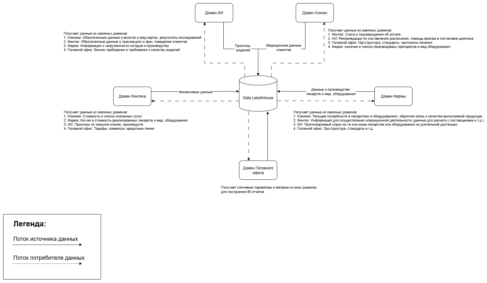

# Задание 2

## Разделение системы на домены

| Домен                     | Комментарии                                                                                                                               |
|---------------------------|-------------------------------------------------------------------------------------------------------------------------------------------|
| **Домен Финтеха**         | Номера счетов, балансов, транзакций, кредитов, баллов, фин. отчеты                                                                        |
| **Домен Головного офиса** | Данные об орг.структуре, внутренние стандарты и т.д.                                                                                      |
| **Домен ИИ**              | Прогнозы моделей, обезличенные датасеты и т.д.                                                                                            |
| **Домен Клиник**          | Мед.карты, расписание, результаты исследований, данные пациентов, данные об услугах, данные о мед. оборудовании                           |
| **Домен Фармы**           | Данные о производстве лекарств и оборудования, объемы, сроки, склады, персонал. _В последствии может быть разделен на 2 отдельных домена_ |

## Обоснование разделения системы на домены
Предлагается отказаться от единого централизованного DWH и перейти на Data Mesh. Каждое подразделение становиться ответственным за свои данные, отвечает за их качество и целостность.  
И предоставляет их другим домена как "товар" через единый каталог в Data LakeHouse. Тем самым мы добиваемся нескольких положительных моментов:
1. Добавление нового направления в бизнесе никак не затронет другие домены, а благодаря готовой инфраструктуре и стандартам его интеграция будет проходить быстрее и проще
2. Высокое качество данных, т.к. каждый домен ответственен за "продажу" своих данных и следует единому стандарту внутри компании
3. Каждый из доменов может "покупать" интересующие его данные, с гарантией того, что эти данные будут качественно подготовлены

## Диаграмма потоков данных

